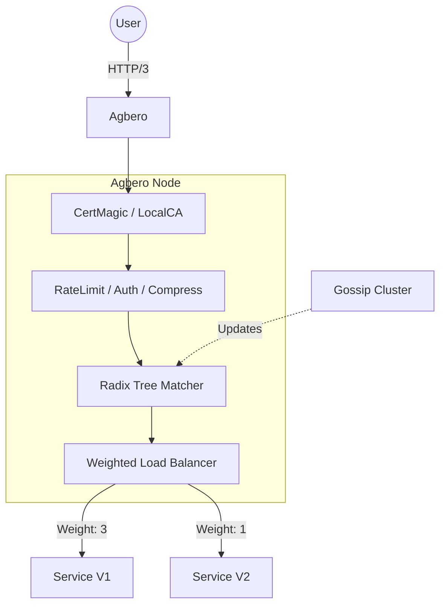

# Agbero

> **Agbero**: *noun* (Yoruba) - A tout or traffic controller at a bus stop.
> **In Context**: A high-performance, production-ready Reverse Proxy and Load Balancer written in Go.

[](https://goreportcard.com/report/git.imaxinacion.net/aibox/agbero)
[](LICENSE)

Agbero bridges the gap between simple development proxies and complex enterprise gateways. It offers **Zero-Config** startup for developers and **Weighted Load Balancing** with **Gossip Discovery** for production clusters.

## ✨ Key Features

-   **🚦 Advanced Traffic Control**:
    -   **Weighted Load Balancing**: Distribute traffic unevenly (e.g., Canary deployments) using Weighted Round-Robin or Random strategies.
    -   **Circuit Breaking**: Automatically cut off unhealthy backends.
    -   **Rate Limiting**: Global and path-specific limits with sharded performance.
-   **🔒 Automatic TLS**:
    -   **Production**: Zero-touch Let's Encrypt issuance and renewal.
    -   **Development**: "Smart TLS" automatically generates and installs local CA certificates (similar to `mkcert`) when running on `localhost`.
-   **🔭 Observability**:
    -   **Structured Logging**: Built-in support for **VictoriaLogs** and JSON file logging.
    -   **Metrics**: Real-time JSON metrics with HDR Histogram latency tracking (P50/P90/P99).
-   **⚡ Modern Protocol Support**: HTTP/1.1, HTTP/2, and **HTTP/3 (QUIC)** enabled by default.
-   **🛠 Developer Experience**:
    -   **Static File Server**: Built-in directory listing and Gzip pre-compression support.
    -   **Hot Reload**: Modify HCL configurations without downtime.

## 🚀 Quick Start

### 1. The "Zero-Config" Run
Navigate to any directory and run `agbero`. It will auto-generate a config, create a local certificate, and serve the current folder.

```bash
# Serves current directory on https://localhost:8443 (auto-generated cert)
agbero run
```

### 2. Production Installation
Agbero includes a service manager for Linux (Systemd), macOS (Launchd), and Windows.

```bash
# Install binary
make build && sudo cp bin/agbero /usr/local/bin/

# Install as a system service
sudo agbero install --config /etc/agbero/config.hcl
sudo agbero start
```

*See [CLI Reference](cmd/agbero/README.md) for detailed service management commands.*

## 📋 Configuration

Agbero uses **HCL** (HashiCorp Configuration Language) for clean, structured configuration.

### Global Config (`config.hcl`)

```hcl
bind {
  http    = [":80", ":8080"]
  https   = [":443"]
  metrics = ":9090"
}

hosts_dir = "./hosts.d"
le_email  = "admin@example.com"

# Built-in VictoriaLogs support
logging {
  level = "info"
  victoria {
    enabled = true
    url     = "http://victoria-logs:9428/insert/jsonline"
  }
}
```

### Host Config (`hosts.d/myapp.hcl`)

#### Weighted Load Balancing
```hcl
domains = ["api.example.com"]

route "/v1" {
  strip_prefixes = ["/v1"]
  
  backend {
    lb_strategy = "round_robin"
    
    # Canary Release: New version gets 1 part traffic
    server {
      address = "http://10.0.0.1:8080"
      weight  = 1
    }
    
    # Stable: Gets 3 parts traffic
    server {
      address = "http://10.0.0.2:8080"
      weight  = 3
    }
  }
}
```

#### Static Site & Dev
```hcl
domains = ["localhost"]

route "/" {
  web {
    root      = "./public"
    index     = "index.html"
    directory = true # Enable directory listing
  }
  
  compression {
    compression = true
    type        = "brotli"
  }
}
```

## 🔧 Service Discovery (Gossip)

Agbero uses HashiCorp Memberlist to form a cluster. Services can join the mesh and announce their routes dynamically without restarting the proxy.

```bash
# 1. Generate identity key
agbero key init

# 2. Issue a token for a service
agbero key gen --service my-app --ttl 8760h
```

*Services use this token to join the Gossip cluster via UDP port 7946.*

## 🏗 Architecture



## 📄 License

MIT
```

---

### `cmd/agbero/README.md` (CLI Reference)

```markdown
# Agbero CLI

This document details the command-line interface for managing the Agbero service.

## Global Flags

| Flag | Description |
|------|-------------|
| `-c, --config` | Path to `config.hcl` (Defaults to `/etc/agbero/config.hcl` or OS equivalent) |
| `-d, --dev` | Enable development mode (Debug logs, Staging LE certificates) |
| `--version` | Show version information |

## Commands

### `run`
Runs Agbero in the foreground. Useful for containers or local development.
- If no config exists at the target path, it **auto-generates** a default one.
- If HTTPS is configured on `localhost`, it **auto-installs** a local CA.

```bash
agbero run --config ./my-config.hcl
```

### Service Management (`install`, `start`, `stop`, `uninstall`)
Manages background services.
- **Linux**: Systemd (`/etc/systemd/system/agbero.service`)
- **macOS**: Launchd (`/Library/LaunchDaemons` or `~/Library/LaunchAgents`)
- **Windows**: Windows Service Control Manager

```bash
# Example: Install and start on Linux
sudo agbero install --config /etc/agbero/config.hcl
sudo agbero start
```

### `validate`
Parses the configuration file and all host files to ensure syntax correctness without starting the server.

```bash
agbero validate
```

### `hosts`
Lists all currently loaded host configurations, including the number of routes and domains per host.

### `key`
Manages cryptographic keys for the Gossip service discovery authentication.

```bash
# Initialize server key
agbero key init

# Generate a token for a microservice
agbero key gen --service "payment-api" --ttl 720h
```

### `cert`
Utilities for managing the local development CA (Certificate Authority).

```bash
# Explicitly install the local CA to the system trust store
agbero cert install-ca

# List locally generated certificates
agbero cert list
```