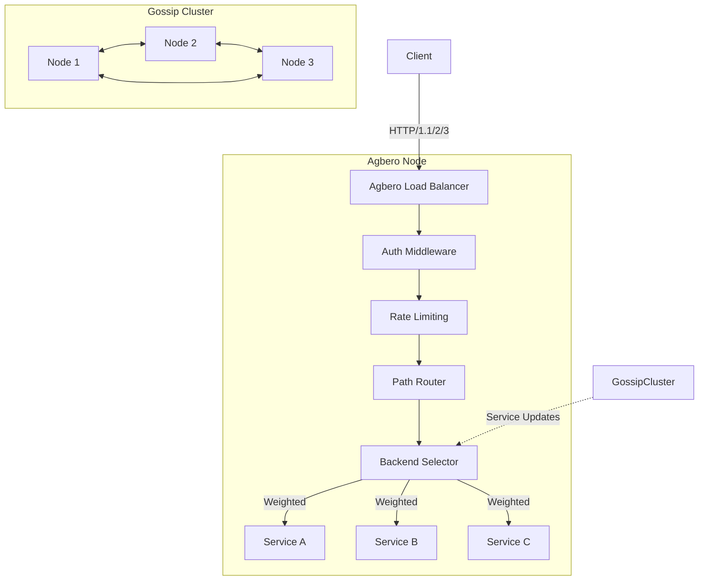

<p align="center">
  
</p>

> **Agbero**: *noun* (Yoruba) - A tout or traffic controller at a bus stop.
> **In Context**: A high-performance, production-ready Reverse Proxy and Load Balancer written in Go.

[](https://goreportcard.com/report/git.imaxinacion.net/aibox/agbero)
[](LICENSE)

Agbero is a modern reverse proxy that bridges local development and production deployments. It offers **Zero-Config TLS for developers** and **Production-Grade Load Balancing** with **Built-in Service Discovery** for clusters.

## ✨ Why Choose Agbero?

### 🚀 For Developers
- **Zero-Config Local HTTPS**: Run `agbero` in any directory for instant HTTPS with auto-trusted certificates
- **Hot Reload**: Modify configurations without restarting
- **Unified Dev/Prod Config**: Same configuration works locally and in production

### 🏭 For Production
- **Weighted Load Balancing**: Support canary deployments and A/B testing
- **Built-in Gossip Protocol**: Automatic service discovery without external dependencies
- **Circuit Breaking & Health Checks**: Automatic failure detection and recovery
- **HDR Histogram Metrics**: Detailed latency tracking (P50/P90/P99/P999)

### 🔒 Security & Observability
- **Automatic TLS**: Let's Encrypt integration with zero downtime renewals
- **Forward Auth**: Integrate with any authentication service
- **Rate Limiting**: Multi-strategy rate limiting with sharded performance
- **Structured Logging**: Native VictoriaLogs and JSON file support

## 🚀 Quick Start

### Installation

```bash
# Download latest release
curl -L https://github.com/your-org/agbero/releases/latest/download/agbero-linux-amd64 -o agbero
chmod +x agbero
sudo mv agbero /usr/local/bin/

# Or build from source
go install git.imaxinacion.net/aibox/agbero/cmd/agbero@latest
```

### The Simplest Possible Start

```bash
# Serves current directory on https://localhost:8443 with auto-generated TLS
agbero run
```

### Production Setup

```bash
# Interactive service installation
sudo agbero install

# Start the service
sudo agbero start
```

## 📋 Core Features

### Smart TLS Management
- **Development**: Auto-generates and trusts local CA certificates
- **Production**: Automatic Let's Encrypt with DNS challenge support
- **Custom CAs**: Bring your own certificate authority

### Advanced Load Balancing
```hcl
route "/api" {
  backend {
    lb_strategy = "weighted_round_robin"
    
    # Canary deployment: 10% traffic to new version
    server {
      address = "http://v2-service:8080"
      weight  = 10
    }
    
    # Stable version: 90% traffic
    server {
      address = "http://v1-service:8080"
      weight  = 90
    }
  }
}
```

### Built-in Service Discovery
```bash
# Initialize gossip cluster
agbero gossip init

# Generate token for services
agbero gossip token --service payment-api --ttl 720h

# Services auto-discover each other via UDP gossip
```

### Comprehensive Middleware
- **Authentication**: Basic Auth, JWT, Forward Auth
- **Security**: Rate limiting, IP whitelisting, request validation
- **Optimization**: Gzip/Brotli compression, HTTP/2 & HTTP/3
- **Observability**: Request tracing, metrics export, structured logging

## 📊 Performance

- **Throughput**: 50k+ requests/second on 4 vCPU
- **Latency**: <1ms P99 for static file serving
- **Memory**: ~15MB idle, ~50MB under load
- **Connections**: 10k+ concurrent connections with HTTP/3

## 🏗 Architecture



## 📚 Documentation

- **[GUIDE.md](GUIDE.md)**: Practical examples and use cases
- **[API Reference](docs/api.md)**: Complete configuration reference
- **[CLI Reference](cmd/agbero/README.md)**: Command-line interface documentation
- **[Examples](examples/)**: Ready-to-run configuration examples

## 🛣 Roadmap

- [x] HTTP/3 (QUIC) support
- [x] Gossip-based service discovery
- [x] Advanced rate limiting
- [ ] WebAssembly middleware
- [ ] OpenTelemetry integration

## 🤝 Contributing

We welcome contributions! Please see our [Contributing Guide](CONTRIBUTING.md) for details.

1. Fork the repository
2. Create a feature branch
3. Add tests for your changes
4. Submit a pull request

## 📄 License

MIT License - see [LICENSE](LICENSE) for details.