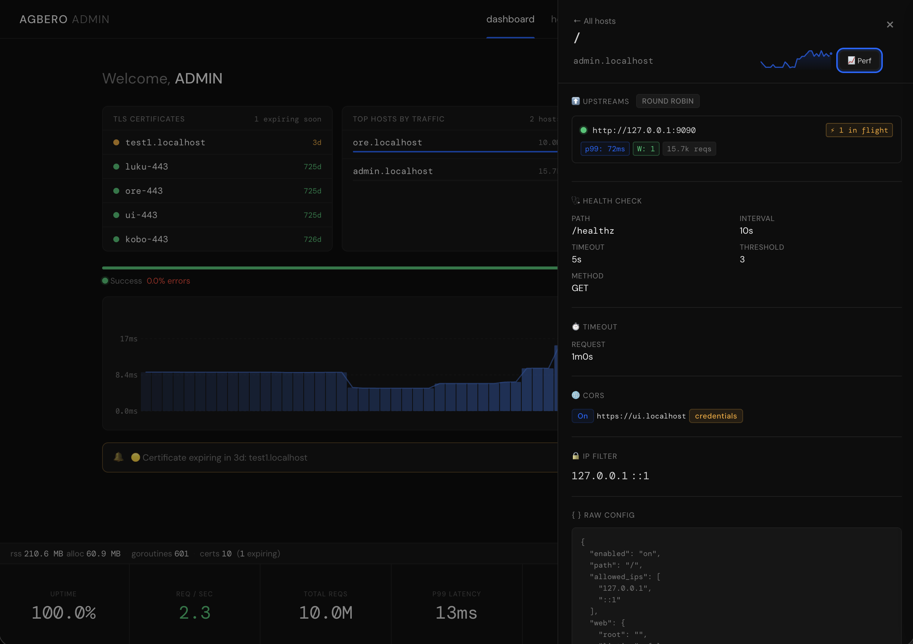
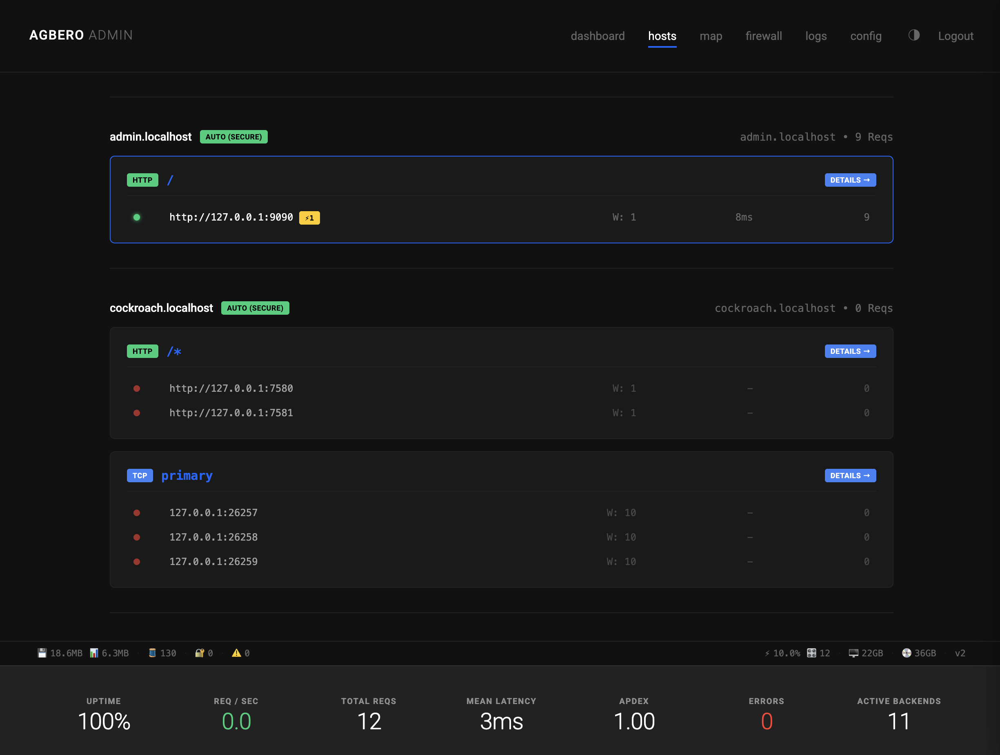
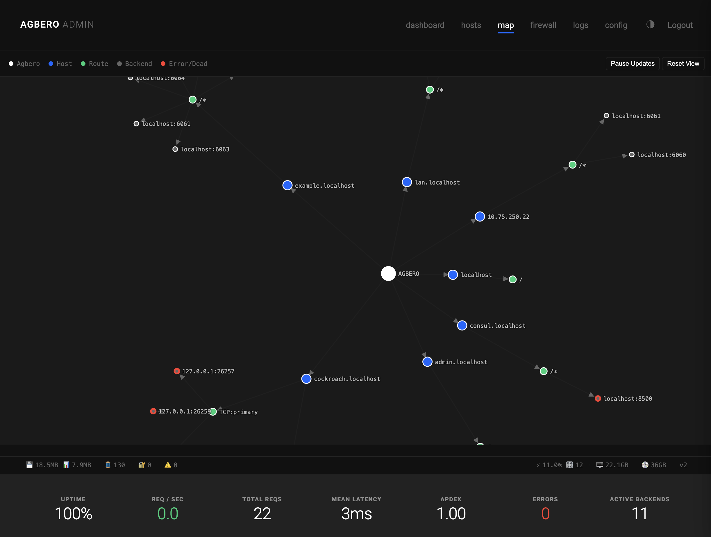

> WARNING: This project is under active development.

<p align="center">
  
</p>


[](https://goreportcard.com/report/github.com/agberohq/agbero)
[](LICENSE)


### **Agbero**: *noun* [`Yoruba`, `English`] - a motor-park tout or conductor who directs traffic, loads buses, checks tickets, and collects tolls.
##### **In Context**: This is exactly what a modern API Gateway does. It sits at the edge of your network, directs incoming API traffic to the right microservices, checks authentication ("tickets"), and enforces rate limits ("tolls").

Agbero is a modern reverse proxy that bridges local development and production deployments. It offers Zero-Config TLS for developers, Production-Grade Load Balancing, Git-based atomic deployments, and a Programmable WASM Data Plane.

Whether you are a JavaScript developer serving a static site, a backend engineer proxying microservices, or running a distributed cluster across multiple nodes — Agbero handles it all from a single binary and a single config file.

## Why Agbero?

<p align="center">
  
</p>


Traditional proxies often rely on static IP-based rules and manual configuration reloads, which break down in modern, dynamic environments. Complex service meshes solve this but introduce massive operational overhead, sidecar injections, and steep learning curves.

Agbero solves these challenges natively:

*   **Identity-Based Rate Limiting:** Stop punishing legitimate users behind corporate NATs. Agbero supports distributed rate limiting and firewalling based on JWT claims, headers, or cookies, synchronized across your cluster via Redis or Gossip.
*   **Centralized Edge Authentication:** Eliminate authentication sprawl. Agbero validates JWTs, handles full OAuth flows (Google, GitHub, OIDC), and integrates with external Forward Auth services directly at the edge.
*   **Zero-Downtime GitOps (Cook):** Deploy static sites and Single Page Applications directly from Git repositories. Agbero pulls, builds isolated deployments, and performs atomic symlink swaps without dropping a single request.
*   **Distributed Cluster Mesh:** No external dependencies required. Agbero nodes automatically discover each other via UDP Gossip and synchronize routing configurations and ACME certificates over reliable TCP streams.
*   **Deep Observability:** Built-in Prometheus and VictoriaMetrics integration provides high-resolution latency histograms and circuit-breaker telemetry without requiring complex log-parsing pipelines.
*   **Serverless Without the Cloud:** Proxy calls to external APIs with credentials injected server-side — no tokens in the browser. Run local scripts on demand, on a schedule, or as background daemons, all defined in HCL.

## Get Started

```bash
# Install
curl -fsSL https://github.com/agberohq/agbero/releases/latest/download/install.sh | sh

# Install as a system service with default configuration
sudo agbero service install

# Or run directly against a config file
agbero run --config agbero.hcl

# Develop locally — serve any directory with trusted HTTPS in one command
agbero cert install
agbero serve . --https
```

## Core Capabilities

<p align="center">
  
</p>


### Traffic Management (L4 & L7)
*   HTTP/1.1, HTTP/2, and HTTP/3 (QUIC) support.
*   TCP Proxying with SNI routing and PROXY Protocol support.
*   11 load balancing strategies: Round Robin, Least Conn, IP Hash, URL Hash, Consistent Hash, Adaptive, Sticky, and more.
*   Automatic Circuit Breaking and Active/Passive Health Probes with 0–100 health scoring.
*   Graceful connection draining and hot-reloading via SIGHUP.

### Security & WAF
*   Automated Let's Encrypt (HTTP-01) and local development CA provisioning — trusted by all browsers.
*   Dynamic Web Application Firewall (WAF) with regex matching, threshold tracking, and auto-banning.
*   Cross-Origin Resource Sharing (CORS) and security header injection.
*   WebAssembly (WASM) middleware for custom, high-performance request filtering.

### Authentication at the Edge
*   HTTP Basic Auth with bcrypt password hashing.
*   JWT validation with claim-to-header forwarding.
*   OAuth 2.0 / OIDC (Google, GitHub, any OIDC provider).
*   Forward Auth — delegate to any external auth service.
*   Mutual TLS (mTLS) with client certificate verification.

### Content Serving
*   High-performance static file serving with on-the-fly Brotli and Gzip compression.
*   FastCGI support for PHP applications.
*   On-the-fly Markdown to HTML rendering with syntax highlighting and table of contents.
*   Git-backed deployments with atomic symlink swaps and webhook push-to-deploy.

### Serverless & Workers
*   Credential-injecting REST proxy — call Stripe, SendGrid, or any API without exposing keys to the browser.
*   On-demand HTTP-triggered process execution with stdin/stdout streaming.
*   Background daemons with automatic restart policies.
*   Cron-scheduled tasks defined in HCL.
*   One-shot startup tasks (migrations, seed data).

## Documentation

<p align="center">
  
</p>


- [**Installation Guide**](./docs/install.md) - Get Agbero running on Linux, macOS, or Windows.
- [**Command Line**](./docs/command.md) - Every command and flag.
- [**Global Config**](./docs/global.md) - Configure bind addresses, TLS, logging, rate limits, and clustering.
- [**Host Config**](./docs/host.md) - Define routes, backends, auth, and TLS per virtual host.
- [**Serverless Guide**](./docs/serverless.md) - REST proxying, workers, and scheduled tasks without the cloud.
- [**Advanced Guide**](./docs/advance.md) - Deep dive into Clustering, Git Deployments, and Firewall tuning.
- [**Plugin Guide**](./docs/plugin.md) - Write custom high-performance middleware using WebAssembly.
- [**API Reference**](./docs/api.md) - Dynamic ephemeral route management via the cluster API.
- [**Contributor Guide**](./docs/contributor.md) - Architecture overview and guidelines for contributing.