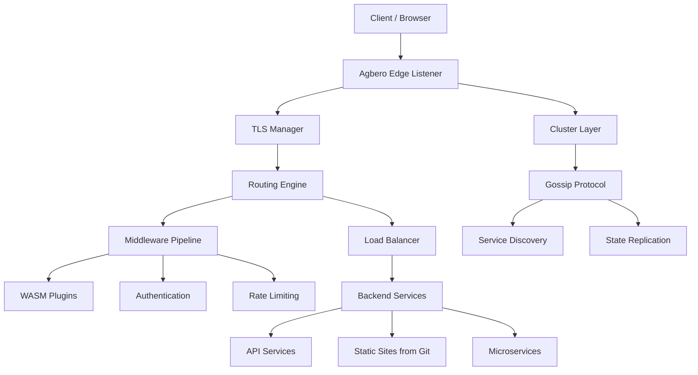

> WARNING: This project is under active development.

<p align="center">
  
</p>


[](https://goreportcard.com/report/github.com/agberohq/agbero)
[](LICENSE)


### **Agbero**: *noun* [`Yoruba` ,`English`] - a motor-park tout or conductor who directs traffic, loads buses, checks tickets, and collects tolls.
##### **In Context**: This is exactly what a modern API Gateway does. It sits at the edge of your network, directs incoming API traffic to the right microservices, checks authentication ("tickets"), and enforces rate limits ("tolls").


Agbero is a modern reverse proxy that bridges local development and production deployments. It offers Zero-Config TLS for developers, Production-Grade Load Balancing, Git-based atomic deployments, and a Programmable WASM Data Plane.

## Why Choose Agbero?

<p align="center">
  
</p>


### For Developers
- **Zero-Config Local HTTPS**: Run `agbero run` in any directory for instant HTTPS with auto-trusted certificates.
- **Hot Reload**: Modify configurations, routes, and WASM plugins without restarting or dropping connections.
- **Unified Config**: Use `${env.VAR}` syntax to make one configuration file work seamlessly across Dev, Staging, and Production.

<p align="center">
  
</p>


### Scalable
- **Atomic Git Deployments**: Serve static sites and Single Page Applications (SPAs) directly from a Git repository with zero-downtime updates via Webhooks or interval polling.
- **Weighted Load Balancing**: Native support for canary deployments and A/B testing.
- **Built-in Gossip Protocol**: Automatic service discovery across nodes without external dependencies like Consul or Zookeeper.
- **Circuit Breaking & Health Checks**: Automatic failure detection, predictive health scoring, and rapid recovery.
- **HDR Histogram Metrics**: Detailed latency tracking (P50/P90/P99) exposed via JSON and the built-in Dashboard.

<p align="center">
  
</p>


### Programmable & Extensible
- **WASM Middleware**: Write custom logic in Go, Rust, or TinyGo and run it safely inside the proxy.
- **Native Authentication**: Built-in support for JWT validation, OAuth (Google, GitHub, OIDC), Basic Auth, and Forward Auth.
- **Rate Limiting**: Identity-based limiting (API Key, IP, Cookie) with distributed sharding.

## Quick Start

### Installation

```bash
# Download latest release
curl -fsSL https://github.com/agberohq/agbero/releases/latest/download/install.sh | bash
```


### The Simplest Possible Start

**1. Persistent Configuration** (Recommended for projects)
```bash
# Init in default location
agbero init

# Init in a specific directory
AGBERO_HOME=/etc/agbero agbero init

# Run Agbero using the generated configuration
agbero run

# Or specify a custom configuration file
agbero run -c /etc/agbero/agbero.hcl
```

**2. Instant Ephemeral Mode** (No config required)
```bash
# Serve the current directory on https://localhost:8000 with auto-generated TLS
agbero serve . --https

# Proxy localhost:3000 to https://app.localhost:8080
agbero proxy :3000 app.localhost --https
```

### Service Setup

```bash
# Interactive service installation (Systemd / Launchd / Windows Service)
sudo agbero service install

# Start the service
sudo agbero service start
```


## Core Features

### 1. Git-Based Atomic Deployments
Deploy static sites and SPAs directly from your Git provider. Agbero securely clones your repository and performs atomic directory swaps with zero downtime when a webhook is triggered.

```hcl
route "/app" {
  strip_prefixes = ["/app"]
  web {
    spa = true
    git {
      enabled = true
      id      = "frontend-app"
      url     = "https://github.com/your-org/spa-builds.git"
      branch  = "main"
      secret  = "${env.GITHUB_WEBHOOK_SECRET}"
    }
  }
}
```

### 2. Smart TLS Management
- **Development**: Auto-generates and trusts local CA certificates.
- **Production**: Automatic Let's Encrypt with HTTP-01 challenge and cluster-wide certificate replication.
- **Custom CAs**: Bring your own certificate authority.

### 3. Advanced Load Balancing & Routing
```hcl
route "/api" {
  backend {
    strategy = "weighted_round_robin"

    # Canary deployment: 10% traffic to new version
    server {
      address = "http://v2-service:8080"
      weight  = 10
    }

    # Stable version: 90% traffic
    server {
      address = "http://v1-service:8080"
      weight  = 90
    }
  }
}
```

## Performance

- **Latency**: <1ms P99 for static file serving.
- **Memory**: ~15MB idle, ~50MB under load.
- **Connections**: 10k+ concurrent connections with HTTP/3 (QUIC) and TCP proxy support.

## Documentation

- **[Global Configuration](docs/global.md)**: Main config reference (`agbero.hcl`).
- **[Host Configuration](docs/host.md)**: Routes, backends, and TLS.
- **[Advanced Guide](docs/advance.md)**: Clustering, Git deployments, health scoring.
- **[Plugin Guide](docs/plugin.md)**: Writing WebAssembly middleware in Go and Rust.
- **[CLI Reference](docs/command.md)**: Command-line interface documentation.
- **[API Reference](docs/api.md)**: Dynamic route management API.

## Roadmap

- [x] Auto-TLS (Local & Let's Encrypt)
- [x] HTTP/3 (QUIC) support
- [x] TCP & HTTP Reverse Proxying
- [x] WebAssembly (WASM) middleware
- [x] Native Authentication (JWT, Basic, OAuth, Forward Auth)
- [x] Advanced rate limiting & Active Firewall
- [x] Gossip-based cluster state synchronization
- [x] Git-based atomic deployments
- [x] Admin Dashboard UI
- [x] Cluster Implementation
- [ ] Better Test Coverage
- [ ] Proper Documentation

## Architecture

Agbero acts as an intelligent **edge traffic controller** that manages incoming requests and routes them to the appropriate backend services. It handles TLS termination, routing logic, middleware execution, and load balancing before forwarding requests to application servers.

The architecture is built around a **high-performance Go runtime**, a **programmable WebAssembly middleware layer**, and a **distributed cluster model powered by a gossip protocol**.



## Contributing

We welcome contributions! Please see our [Contributing Guide](docs/contributor.md) for details.

1. Fork the repository.
2. Create a feature branch.
3. Add tests for your changes.
4. Submit a pull request.

## License

MIT License - see [LICENSE](LICENSE) for details.